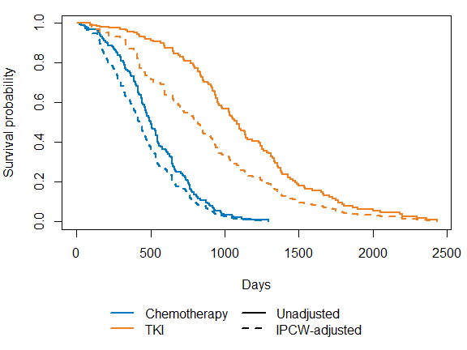
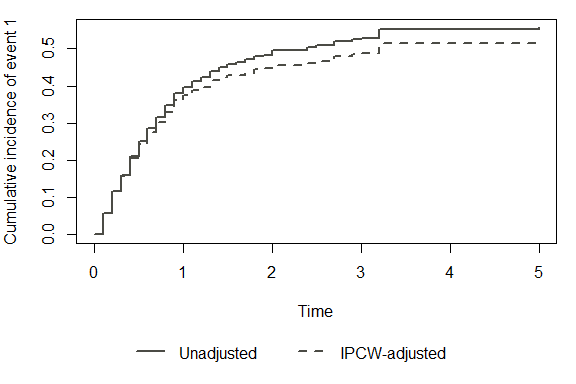

<!-- README.md is generated from README.Rmd. Please edit that file -->

# ipcw

<!-- badges: start -->

[](https://lifecycle.r-lib.org/articles/stages.html#stable)
[](https://github.com/zabore/ipcw/actions/workflows/R-CMD-check.yaml)
<!-- badges: end -->

The ipcw package estimates inverse probability of censoring weights
(IPCW) for right-censored data for either a single event or competing
events.

## Installation

You can install the development version of ipcw from
[GitHub](https://github.com/) with:

``` r
# install.packages("pak")
pak::pak("zabore/ipcw")
```

## Example

Dependent censoring can bias standard survival estimates. The examples
below use the package’s simulated example datasets to compare unadjusted
estimates to IPCW-adjusted estimates, for both a single event and
competing risks.

### Single event

``` r
library(ipcw)
library(survival)

set.seed(20240429)
dat <- sim_data_se(n = 500)

# Unadjusted (naive) Kaplan-Meier, ignoring dependent censoring
naive_fit <- survfit(Surv(t, delta) ~ x, data = dat)

# IPCW-adjusted Kaplan-Meier
dat_long <- get_ipcw_wgt_se(dat)
ipcw_fit <- survfit(Surv(tstart, tstop, delta) ~ x, data = dat_long,
                     weights = wgt, timefix = FALSE)

layout(matrix(1:2, nrow = 2), heights = c(5, 1))
par(mar = c(4, 4, 1, 1))
plot(naive_fit, col = c("#0078bf", "#f08122"), lty = 1, lwd = 2,
     xlab = "Days", ylab = "Survival probability")
lines(ipcw_fit, col = c("#0078bf", "#f08122"), lty = 2, lwd = 2)
par(mar = c(0, 0, 0, 0))
plot.new()
legend("center", legend = c("Chemotherapy", "TKI", "Unadjusted", "IPCW-adjusted"),
       col = c("#0078bf", "#f08122", "black", "black"),
       lty = c(1, 1, 1, 2), lwd = 2, ncol = 2, bty = "n")
```



See `vignette("single-event-guided-example")` for the full walkthrough,
including bootstrap confidence intervals and Cox regression.

### Competing risks

``` r
set.seed(9843)
dat_cr <- sim_data_cr(n = 500, censoring = "baseline")

esttimes <- seq(0, 5, 0.1)

# Unadjusted (naive) cumulative incidence, ignoring dependent censoring
ci_naive <- cuminc_naive_cr(dat_cr, esttimes)

# IPCW-adjusted cumulative incidence
dat_long_cr <- add_ipcw_weights_cr(wide_to_long_cr(dat_cr), strat = "no")
ci_ipcw     <- cuminc_ipcw_cr(dat_long_cr, esttimes)

layout(matrix(1:2, nrow = 2), heights = c(5, 1))
par(mar = c(4, 4, 1, 1))
plot(esttimes, ci_naive, type = "s", col = "#4b4b45", lty = 1, lwd = 2,
     xlab = "Time", ylab = "Cumulative incidence of event 1",
     ylim = c(0, max(ci_naive, ci_ipcw, na.rm = TRUE)))
lines(esttimes, ci_ipcw, type = "s", col = "#4b4b45", lty = 2, lwd = 2)
par(mar = c(0, 0, 0, 0))
plot.new()
legend("center", legend = c("Unadjusted", "IPCW-adjusted"),
       col = "#4b4b45", lty = c(1, 2), lwd = 2, ncol = 2, bty = "n")
```



See `vignette("competing-risks-guided-example")` for the full
walkthrough, including Fine-Gray regression and bootstrap standard
errors.
