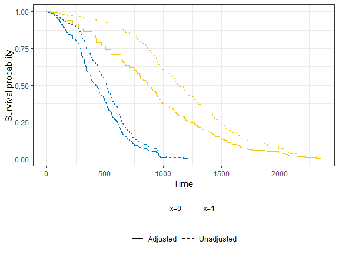
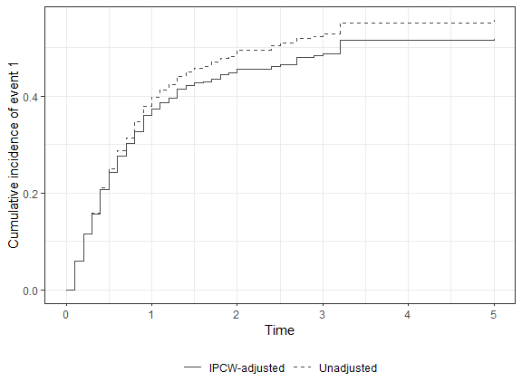

<!-- README.md is generated from README.Rmd. Please edit that file -->

# ipcw

<!-- badges: start -->

[](https://lifecycle.r-lib.org/articles/stages.html#stable)
[](https://github.com/zabore/ipcw/actions/workflows/R-CMD-check.yaml)
<!-- badges: end -->

The ipcw package estimates inverse probability of censoring weights
(IPCW) for right-censored data for either a single event or competing
events.

## Installation

You can install the development version of ipcw from
[GitHub](https://github.com/) with:

``` r
# install.packages("pak")
pak::pak("zabore/ipcw")
```

## Example

Dependent censoring occurs when participants who are censored at any
point in time are more, or less, likely to have an event going forward
as compared to the participants who remain in the study. This leads to
the distribution of residual time to the event of interest being
different in censored and uncensored populations. Dependent censoring
can bias standard survival estimates. The examples below use the ipcw
package’s simulated example datasets to compare unadjusted estimates to
IPCW-adjusted estimates, for both a single event and competing risks.

``` r
# Install packages if needed
# install.packages(c(""survival", "ggsurvfit", "dplyr"))
# install.packages("pak")
# pak::pak("zabore/ipcw")

# Load packages
library(ipcw)
library(survival)
library(ggsurvfit)
library(dplyr)
```

### Single event

In this example there is a single event type, and one covariate of
interest, x.

``` r
set.seed(67)

dat <- sim_data_se(n = 500)

# Unadjusted (naive) Kaplan-Meier, ignoring dependent censoring
naive_fit <- 
  survfit(
    Surv(t, delta) ~ x, 
    data = dat)

# Convert to counting-process (long) format and compute IPCW
dat_long <- get_ipcw_wgt_se(dat)

# IPCW-adjusted Kaplan-Meier
ipcw_fit <- 
  survfit(
    Surv(tstart, tstop, delta) ~ x, 
    data = dat_long,
    weights = wgt, 
    timefix = FALSE)
```



Note that this plot is for demonstration purposes only. In practice,
when dependent censoring is present only the IPCW-adjusted curves would
be of interest. In this example, we see that the unadjusted estimates
over-estimate the survival probability in both groups, and adjustment
for dependent censoring corrects for this. See
`vignette("single-event-guided-example")` for a thorough demonstration
of the methods implemented in this package for single event settings,
including bootstrap confidence intervals for the IPCW-adjusted
Kaplan-Meier curves and Cox regression.

### Competing risks

``` r
set.seed(9843)

dat_cr <- sim_data_cr(n = 500, censoring = "baseline")

esttimes <- seq(0, 5, 0.1)

# Unadjusted (naive) cumulative incidence, ignoring dependent censoring
ci_naive <- cuminc_naive_cr(dat_cr, esttimes)

# Convert to counting-process (long) format and compute IPCW
dat_long_cr <- add_ipcw_weights_cr(wide_to_long_cr(dat_cr), strat = "no")

# IPCW-adjusted cumulative incidence
ci_ipcw     <- cuminc_ipcw_cr(dat_long_cr, esttimes)
```



In this example, we see that the unadjusted estimates overestimate the
cumulative incidence of event 1 in the presence of the competing risk of
event 2. Adjustment for dependent censoring through weighting corrects
this. See `vignette("competing-risks-guided-example")` for a thorough
demonstration of the methods implemented in this package for competing
risks settings, including Fine-Gray regression and bootstrap standard
errors.
