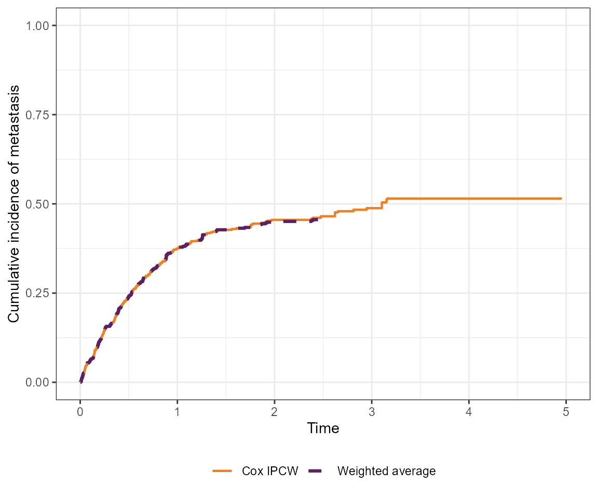
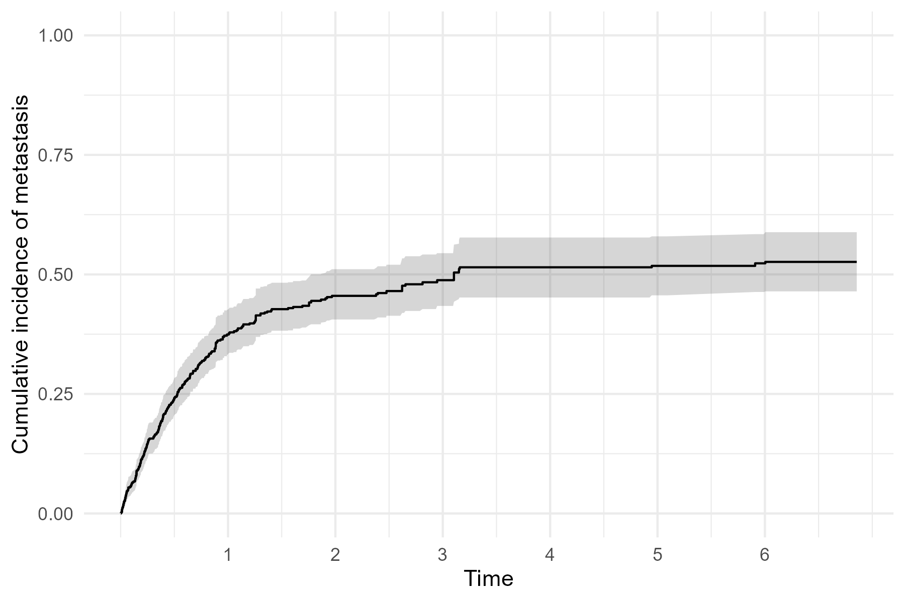

# Competing Risks IPCW: Guided Example

This vignette demonstrates IPCW methods for competing risks data. We use
a simulated dataset in line with an observational clinical setting where
participants are followed for metastasis after undergoing radical
prostatectomy. We consider metastasis and death to be competing events.
We wish to understand how patterns of metastasis vary by the level of
prostate specific antigen (PSA) measured immediately after surgery
(referred to as baseline PSA). Participants are censored when they stop
attending follow-up visits at the cancer center where they had their
prostatectomy and resume visiting their primary care doctor. Dependent
censoring arises because participants with a higher baseline PSA are
less likely to be censored and more likely to experience metastasis.

## Setup

``` r

# Install packages if needed
# install.packages(c("survival", "purrr", "ggplot2", "gt", "tibble"))
# install.packages("pak")
# pak::pak("zabore/ipcw")

library(ipcw)
library(survival)
library(ggplot2)
library(purrr)
library(gt)
library(tibble)
```

## Simulate data and compute IPCW weights

First, create a simulated dataset of `n=500` patients using the
[`sim_data_cr()`](https://www.emilyzabor.com/ipcw/reference/sim_data_cr.md)
function. We use baseline-dependent censoring so that censoring is
informative, and keep other parameters besides n at the default values:

``` r

set.seed(9843)

dat <- 
  sim_data_cr(
    n = 500,
    censoring = "baseline",
    beta1 = log(1.5),
    beta2 = log(2.25),
    beta3 = log(3.4),
    p = 0.3
    )
```

Key columns in the simulated data include:

- `z1`: baseline PSA quartile (0 = lowest, 3 = highest)
- `delta`: event indicator (1 = metastasis, 2 = death, 0 = censored)
- `t`: observed time (event or censoring)

[`wide_to_long_cr()`](https://www.emilyzabor.com/ipcw/reference/wide_to_long_cr.md)
converts the data to long format, which is required for IPCW estimation.
The
[`add_ipcw_weights_cr()`](https://www.emilyzabor.com/ipcw/reference/add_ipcw_weights_cr.md)
function computes IPCW weights for competing risks data. The `strat`
argument specifies whether to use stratified (non-parametric) weights
(when `strat = "yes"`) or Cox model weights (when `strat = "no"`).

``` r

dat_long <- wide_to_long_cr(dat)

# Cox model weights
dat_long_cox <- add_ipcw_weights_cr(dat_long, strat = "no")

# Stratified (non-parametric) weights
dat_long_strat <- add_ipcw_weights_cr(dat_long, strat = "yes")
```

## IPCW cumulative incidence curves

``` r

# Get an ordered vector of times
esttimes <- sort(dat$t)

# Estimate cumulative incidence using the stratified (non-parametric) IPCW
ci_strat <- cuminc_waverage_cr(dat, esttimes)

# Estimate cumulative incidence using the Cox model IPCW
ci_cox <- cuminc_ipcw_cr(dat_long_cox, esttimes)
```

``` r

# Combine the two sets of weights for plotting
to_plot <- 
  rbind(
    data.frame(time = esttimes, est = ci_strat, method = "Weighted average"),
    data.frame(time = esttimes, est = ci_cox,  method = "Cox IPCW")
    )

ggplot(to_plot, aes(x = time, y = est, 
                    color = method, linetype = method, linewidth = method)) +
  geom_step() +
  scale_color_manual(values = c("#f08122", "#5c2161")) +
  scale_linetype_manual(values = c("solid", "dashed")) +
  scale_linewidth_manual(values = c(0.8, 1.1)) +
  xlim(0, 5) + 
  ylim(0, 1) +
  labs(
    x = "Time",
    y = "Cumulative incidence of metastasis"
  ) +
  theme_bw() +
  theme(
    legend.position = "bottom", 
    legend.title = element_blank()
    )
#> Warning: Removed 52 rows containing missing values or values outside the scale range
#> (`geom_step()`).
```



The two sets of weights result in nearly identical weighted cumulative
incidence curves in this example.

## Fine-Gray regression

Next, estimate the subdistribution hazard ratio (SHR) for the
association between baseline PSA and metastasis, accounting for the
competing risk of death and dependent censoring.

The
[`fg_split_cr()`](https://www.emilyzabor.com/ipcw/reference/fg_split_cr.md)
function splits the data into event-specific datasets, and the
[`add_fg_weights_cr()`](https://www.emilyzabor.com/ipcw/reference/add_fg_weights_cr.md)
function computes weights for Fine-Gray regression. The
[`fg_weighted_cr()`](https://www.emilyzabor.com/ipcw/reference/fg_weighted_cr.md)
function fits a weighted Fine-Gray model.

``` r

# Split the data into event-specific datasets for Fine-Gray regression
dat_long_fg <- fg_split_cr(dat_long)

# Stratified weights
dat_long_fg_strat <- add_fg_weights_cr(dat_long_fg, strat = "yes")
fg_strat <- fg_weighted_cr(dat_long_fg_strat, extend = FALSE)
exp(fg_strat[, 1])   # exponentiated coefficients
#>      z11      z12      z13 
#> 1.707717 2.529884 3.168057

# Cox model weights
dat_long_fg_cox <- add_fg_weights_cr(dat_long_fg, strat = "no")
fg_cox <- fg_weighted_cr(dat_long_fg_cox)
exp(fg_cox[, 1])
#>      z11      z12      z13 
#> 1.747758 2.574544 3.124305

# Table of results
tibble(
    Method = rep(c("Fine-Gray stratified", "Fine-Gray Cox"), each = 3),
    Effect = rep(c("PSA Q2 vs Q1", "PSA Q3 vs Q1", "PSA Q4 vs Q1"), 2),
    Estimate = c(exp(fg_strat[, 1]), exp(fg_cox[, 1]))
  ) |> 
  gt() |> 
  fmt_number(columns = "Estimate", decimals = 2) |>
  tab_header("Fine-gray regression results for the association between PSA and metastasis, using both stratified and Cox weights") 
```

| Fine-gray regression results for the association between PSA and metastasis, using both stratified and Cox weights |  |  |
|----|----|----|
| Method | Effect | Estimate |
| Fine-Gray stratified | PSA Q2 vs Q1 | 1.71 |
| Fine-Gray stratified | PSA Q3 vs Q1 | 2.53 |
| Fine-Gray stratified | PSA Q4 vs Q1 | 3.17 |
| Fine-Gray Cox | PSA Q2 vs Q1 | 1.75 |
| Fine-Gray Cox | PSA Q3 vs Q1 | 2.57 |
| Fine-Gray Cox | PSA Q4 vs Q1 | 3.12 |

## Bootstrap standard errors

Bootstrap resampling provides valid standard errors when the weights are
estimated.
[`get_ipcw_boot_cr()`](https://www.emilyzabor.com/ipcw/reference/get_ipcw_boot_cr.md)
draws bootstrap samples from the wide-format data, converts each to long
format, and appends IPCW weights in one step, mirroring
[`get_ipcw_boot_se()`](https://www.emilyzabor.com/ipcw/reference/get_ipcw_boot_se.md)
for the single-event case. Its `strat` argument controls the weight
type, matching
[`add_ipcw_weights_cr()`](https://www.emilyzabor.com/ipcw/reference/add_ipcw_weights_cr.md).
Because this process takes some time, the resulting object
`fg_strat_boot` is included in this package.

``` r

# Bootstrap samples with Cox IPCW weights
boot_dat_long <- get_ipcw_boot_cr(dat, B = 500, strat = "no", seed = 20240917)

# Fit the stratified Fine-Gray model to each bootstrap sample
fg_strat_boot <- 
  map(
    boot_dat_long, 
    ~ fg_weighted_cr(
      add_fg_weights_cr(fg_split_cr(.), strat = "yes"), extend = FALSE)[, 1]
    )

fg_strat_boot <- matrix(unlist(fg_strat_boot), ncol = 3, byrow = TRUE)
```

[`get_boot_pci_cr()`](https://www.emilyzabor.com/ipcw/reference/get_boot_pci_cr.md)
then computes the bootstrap percentile interval for each column of a
matrix of bootstrap estimates, mirroring
[`get_boot_pci_se()`](https://www.emilyzabor.com/ipcw/reference/get_boot_pci_se.md)
for the single-event case.

``` r

pci_fg_strat <- get_boot_pci_cr(fg_strat_boot)


result_tab <- data.frame(
  Effect = c("PSA Q2 vs Q1", "PSA Q3 vs Q1", "PSA Q4 vs Q1"),
  Estimate = exp(fg_strat[, 1]),
  Lower_95pct_PI = exp(pci_fg_strat["lower", ]),
  Upper_95pct_PI = exp(pci_fg_strat["upper", ])
)

result_tab |> 
  gt() |> 
  fmt_number(
    columns = c("Estimate", "Lower_95pct_PI", "Upper_95pct_PI"), 
    decimals = 2) |> 
  cols_label(
    Lower_95pct_PI = "Lower 95% PI",
    Upper_95pct_PI = "Upper 95% PI"
  ) |> 
  # Add a footnote
  tab_footnote(
    footnote = "PI = percentile interval",
    locations = cells_column_labels(columns = c(Lower_95pct_PI, Upper_95pct_PI))
  ) |> 
  tab_header(
    "Fine-Gray regression results for the association between PSA and metastasis, using stratified weights"
  )
```

| Fine-Gray regression results for the association between PSA and metastasis, using stratified weights |  |  |  |
|----|----|----|----|
| Effect | Estimate | Lower 95% PI¹ | Upper 95% PI¹ |
| PSA Q2 vs Q1 | 1.71 | 1.02 | 3.11 |
| PSA Q3 vs Q1 | 2.53 | 1.57 | 4.32 |
| PSA Q4 vs Q1 | 3.17 | 1.97 | 5.55 |
| ¹ PI = percentile interval |  |  |  |

The bootstrap logic can be generalized to any competing risks quantity
that returns a vector or matrix of estimates. For example,
[`plot_ipcw_cuminc_boot_ci_cr()`](https://www.emilyzabor.com/ipcw/reference/plot_ipcw_cuminc_boot_ci_cr.md)
combines the bootstrap samples from
[`get_ipcw_boot_cr()`](https://www.emilyzabor.com/ipcw/reference/get_ipcw_boot_cr.md)
with the Cox IPCW cumulative incidence estimate to produce a cumulative
incidence plot with bootstrap percentile confidence intervals, mirroring
[`plot_ipcw_km_boot_ci_se()`](https://www.emilyzabor.com/ipcw/reference/plot_ipcw_km_boot_ci_se.md)
for the single-event case. Bootstrapping the data and then generating
the pointwise confidence intervals is time consuming, and the below code
is not evaluated here. The following plot is an IPCW weighted cumulative
incidence of metastatis, using the Cox model weights, with bootstrap
confidence intervals.

``` r

boot_dat_long <- 
  get_ipcw_boot_cr(
    dat, 
    B = 500, 
    strat = "no", 
    seed = 20240917)

plot_base <- 
  plot_ipcw_cuminc_boot_ci_cr(
    boot_dat_long, 
    dat_long_cox, 
    esttimes = esttimes)

plot_base +
  scale_x_continuous(breaks = seq(1, 6, 1)) + 
  scale_y_continuous(limits = c(0, 1)) +
  labs(
    x = "Time",
    y = "Cumulative incidence of metastasis"
  ) 
```


