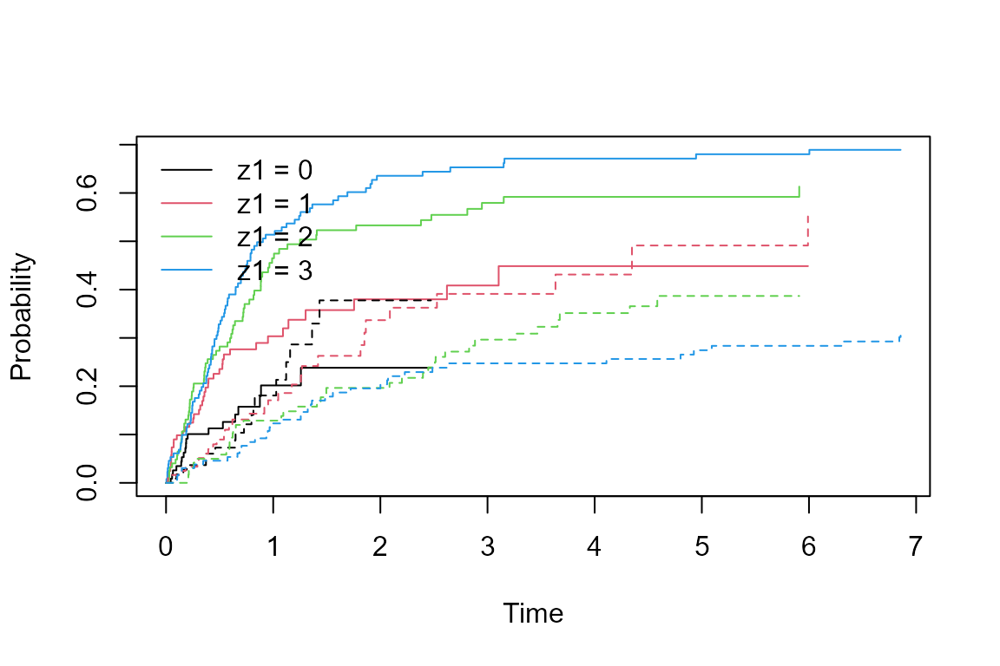
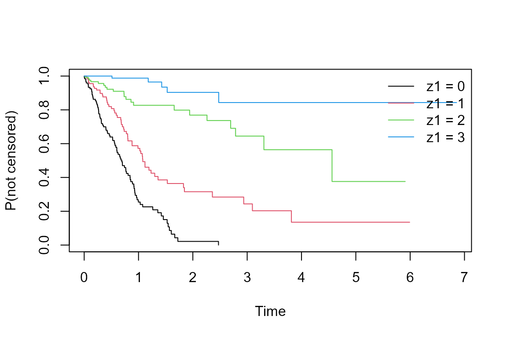
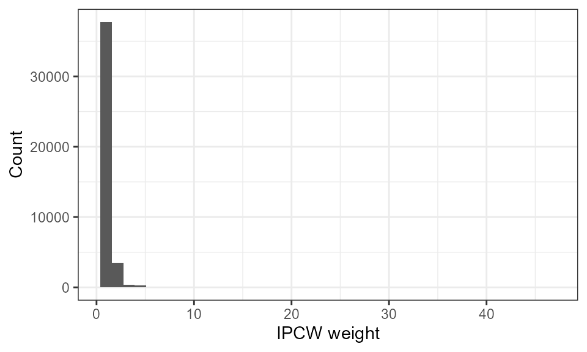

# Competing Risks IPCW: Guided Example

This vignette demonstrates IPCW methods for competing risks data. We
simulate a prostate cancer dataset where metastasis (event\_1) and death
(event\_2) are competing risks, and PSA quartile at baseline (`z1`) both
predicts metastasis risk and drives informative censoring.

## Setup

``` r
library(ipcw)
library(survival)
library(ggplot2)
library(purrr)
```

## Simulate data

`sim_data_CR()` generates competing risks data under a sub-distribution
hazard model. The covariate `z1` is a four-level factor (PSA quartile).
We use baseline-dependent censoring so that censoring is informative.

``` r
set.seed(9843)
dat <- sim_data_CR(
  n          = 500,
  censoring  = "baseline",
  beta1      = log(1.5),
  beta2      = log(2.25),
  beta3      = log(3.4),
  p          = 0.3
)
table(dat$delta)
#> 
#>  censor event_1 event_2 
#>     165     212     123
```

## Explore the data

``` r
# Cumulative incidence by PSA quartile
plot(survfit(Surv(t, delta) ~ z1, data = dat),
     col = 1:4, lty = rep(1:2, each = 4),
     xlab = "Time", ylab = "Probability")
legend("topleft", legend = paste("z1 =", 0:3), col = 1:4, lty = 1, bty = "n")
```



``` r
# Censoring distribution by PSA quartile
plot(survfit(Surv(t, delta == "censor") ~ z1, data = dat),
     col = 1:4, xlab = "Time", ylab = "P(not censored)")
legend("topright", legend = paste("z1 =", 0:3), col = 1:4, lty = 1, bty = "n")
```



## Convert to long format and add IPCW weights

``` r
dat_long <- wide_to_long_CR(dat)

# Cox model weights
dat_long_cox <- add_ipcw_weights(dat_long, strat = "no")

# Stratified (non-parametric) weights
dat_long_strat <- add_ipcw_weights(dat_long, strat = "yes")
```

``` r
ggplot(dat_long_strat, aes(x = 1 / p_notcens)) +
  geom_histogram(bins = 40) +
  xlab("IPCW weight") + ylab("Count") +
  theme_bw()
```



## Estimate cumulative incidence

``` r
esttimes <- sort(dat$t)

ci_naive   <- cuminc_naive(dat, esttimes)
ci_wavg    <- cuminc_waverage(dat, esttimes)
ci_cox     <- cuminc_ipcw(dat_long_cox, esttimes)
```

``` r
to_plot <- rbind(
  data.frame(time = esttimes, est = ci_wavg, method = "Weighted average"),
  data.frame(time = esttimes, est = ci_cox,  method = "Cox IPCW")
)

ggplot(to_plot, aes(x = time, y = est, colour = method)) +
  geom_step() +
  xlim(0, 5) + ylim(0, 0.65) +
  xlab("Time") + ylab("Cumulative incidence of event 1") +
  theme_bw(base_size = 14) +
  theme(legend.position = "bottom", legend.title = element_blank())
#> Warning: Removed 52 rows containing missing values or values outside the scale range
#> (`geom_step()`).
```


## Fine-Gray IPCW regression

``` r
dat_long_fg <- fg_split(dat_long)

# Stratified weights
dat_long_fg_strat <- add_fg_weights(dat_long_fg, strat = "yes")
fg_strat <- fg_weighted(dat_long_fg_strat, extend = FALSE)
exp(fg_strat[, 1])   # exponentiated coefficients
#>      z11      z12      z13 
#> 1.707717 2.529884 3.168057

# Cox model weights
dat_long_fg_cox <- add_fg_weights(dat_long_fg, strat = "no")
fg_cox <- fg_weighted(dat_long_fg_cox)
exp(fg_cox[, 1])
#>      z11      z12      z13 
#> 1.747758 2.574544 3.124305
```

## Bootstrap standard errors

Bootstrap resampling provides valid standard errors when the weights are
estimated. The example below uses 500 samples; run in parallel as
needed.

``` r
set.seed(20240917)

boot_dat      <- map(1:500, ~ slice_sample(dat, prop = 1, replace = TRUE))
boot_dat      <- map(boot_dat, function(x) { x$id <- seq_len(nrow(x)); x })
boot_dat_long <- map(boot_dat, wide_to_long_CR)

# Weighted-average cumulative incidence bootstrap
w_avg_boot <- map(boot_dat, ~ cuminc_waverage(., esttimes))
w_avg_boot <- matrix(unlist(w_avg_boot), ncol = length(esttimes), byrow = TRUE)
lower_wavg  <- apply(w_avg_boot, 2, function(x)
                 ifelse(any(is.na(x)), NA, quantile(x, 0.025)))
upper_wavg  <- apply(w_avg_boot, 2, function(x)
                 ifelse(any(is.na(x)), NA, quantile(x, 0.975)))

# Cox IPCW cumulative incidence bootstrap
cox_boot      <- map(boot_dat_long, ~ cuminc_ipcw(add_ipcw_weights(., strat = "no"), esttimes))
cox_boot      <- matrix(unlist(cox_boot), ncol = length(esttimes), byrow = TRUE)
lower_cox     <- apply(cox_boot, 2, function(x)
                   ifelse(any(is.na(x)), NA, quantile(x, 0.025)))
upper_cox     <- apply(cox_boot, 2, function(x)
                   ifelse(any(is.na(x)), NA, quantile(x, 0.975)))

# Fine-Gray stratified bootstrap
boot_dat_fg   <- map(boot_dat_long, fg_split)
fg_strat_boot <- map(boot_dat_fg, ~ fg_weighted(add_fg_weights(., strat = "yes"),
                                                 extend = FALSE)[, 1])
fg_strat_boot <- matrix(unlist(fg_strat_boot), ncol = 3, byrow = TRUE)
lower_fg_strat <- apply(fg_strat_boot, 2, function(x)
                     ifelse(any(is.na(x)), NA, quantile(x, 0.025)))
upper_fg_strat <- apply(fg_strat_boot, 2, function(x)
                     ifelse(any(is.na(x)), NA, quantile(x, 0.975)))

exp(fg_strat[, 1])
exp(lower_fg_strat)
exp(upper_fg_strat)
```
