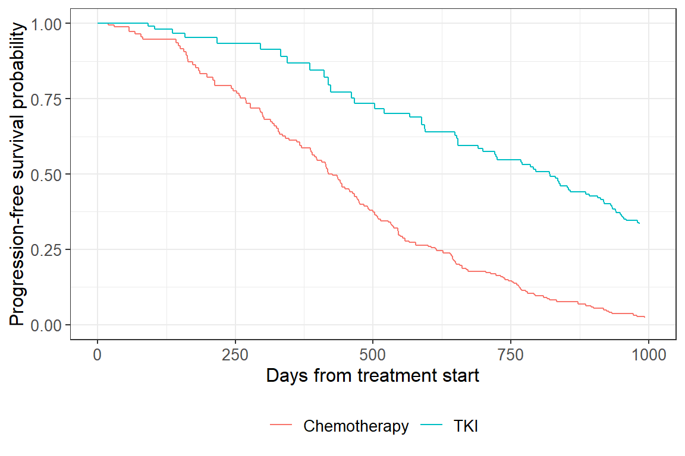

# Single-Event IPCW: Guided Example

This vignette demonstrates inverse probability of censoring weighting
(IPCW) for a single-event survival outcome. We use a simulated dataset
that mimics a clinical trial comparing two treatments (chemotherapy
vs. TKI) on progression-free survival, where censoring is informative
because it depends on an ancillary biomarker (`W2`).

## Setup

``` r

library(ipcw)
library(survival)
library(purrr)
```

## Data

The package ships with `single_example_dat`, a simulated dataset of 500
subjects generated with `set.seed(20240429)`. The key variables are:

- `t`: observed time (event or censoring)
- `delta`: event indicator (1 = event, 0 = censored)
- `x`: treatment (0 = chemotherapy, 1 = TKI)
- `W2`: ancillary biomarker that drives informative censoring

``` r

data(single_example_dat)
head(single_example_dat)
#> # A tibble: 6 × 5
#>       S      t delta     x     W2
#>   <dbl>  <dbl> <dbl> <int>  <dbl>
#> 1  427.  427.      1     0 0.533 
#> 2 1541. 1541.      1     1 0.986 
#> 3  417.  417.      1     0 0.579 
#> 4 1095.  327.      0     1 0.701 
#> 5  108.   51.5     0     0 0.0469
#> 6  768.  768.      1     0 0.889
```

The code below re-creates this dataset from scratch, so you can see
exactly how it was generated.

``` r

# Fix simulation parameters
n       <- 500
alpha   <- 0.05
x_prop  <- 0.5
a       <- 2
sigma   <- 500
beta    <- log(0.25)
lambda  <- 0.01
phi     <- -5

set.seed(20240429)

Y1 <- rexp(n, rate = 1)
Y2 <- rexp(n, rate = 1)
Z  <- rgamma(n, shape = alpha, rate = 1)
W1 <- (1 + Y1 / Z)^(-alpha)
W2 <- (1 + Y2 / Z)^(-alpha)
x  <- rbinom(n, 1, prob = x_prop)

S     <- sigma * (-log(1 - W1) / exp(beta * x))^(1 / a)
C     <- rexp(n, rate = lambda * exp(phi * W2))
t     <- pmin(S, C)
delta <- as.integer(S <= C)

single_example_dat <- tibble::tibble(S, t, delta, x, W2)
```

## Prepare data and compute IPCW weights

[`get_ipcw_wgt()`](https://zabore.github.io/ipcw/reference/get_ipcw_wgt.md)
converts the wide dataset to counting-process (long) format and appends
the unstabilized IPCW weight column `wgt`. The package also provides
`single_example_ipcw_dat` with these weights pre-computed.

``` r

data(single_example_ipcw_dat)
head(single_example_ipcw_dat)
#> # A tibble: 6 × 11
#>   id_nest true_time     x    W2    id tstart tstop delta censor inv_wgt   wgt
#>     <int>     <dbl> <int> <dbl> <int>  <dbl> <dbl> <dbl>  <dbl>   <dbl> <dbl>
#> 1       1      427.     0 0.533     1  0     0.688     0      0   1      1   
#> 2       1      427.     0 0.533     1  0.688 1.28      0      0   0.999  1.00
#> 3       1      427.     0 0.533     1  1.28  2.77      0      0   0.999  1.00
#> 4       1      427.     0 0.533     1  2.77  5.15      0      0   0.998  1.00
#> 5       1      427.     0 0.533     1  5.15  5.79      0      0   0.997  1.00
#> 6       1      427.     0 0.533     1  5.79  6.18      0      0   0.997  1.00
```

Alternatively, compute the weights directly:

``` r

dat_long <- get_ipcw_wgt(single_example_dat)
```

## IPCW Kaplan-Meier curves

The chunk below requires the **ggsurvfit** package. If it is not
installed, you can plot the IPCW K-M curves with base R instead (see the
commented code).

``` r

library(ggsurvfit)
#> Warning: package 'ggsurvfit' was built under R version 4.5.1
#> Loading required package: ggplot2
km_fit2 <- survfit2(Surv(tstart, tstop, delta) ~ x,
                    data    = single_example_ipcw_dat,
                    weights = single_example_ipcw_dat$wgt,
                    timefix = FALSE)
ggsurvfit(km_fit2) +
  xlim(c(0, 1000)) +
  scale_color_hue(labels = c("Chemotherapy", "TKI")) +
  labs(
    x = "Days from treatment start",
    y = "Progression-free survival probability"
  )
#> Warning: Removed 81 rows containing missing values or values outside the scale range
#> (`geom_step()`).
```



``` r

km_fit <- survfit(Surv(tstart, tstop, delta) ~ x,
                  data    = single_example_ipcw_dat,
                  weights = wgt,
                  timefix = FALSE)
plot(km_fit, col = 1:2, xlim = c(0, 1000),
     xlab = "Days from treatment start",
     ylab = "Progression-free survival probability")
legend("topright", legend = c("Chemotherapy", "TKI"), col = 1:2, lty = 1)
```

## IPCW Cox regression

``` r

ipcw_cox_fit <- coxph(
  Surv(tstart, tstop, delta) ~ x + cluster(id),
  data    = single_example_ipcw_dat,
  weights = single_example_ipcw_dat$wgt,
  timefix = FALSE
)
summary(ipcw_cox_fit)$coef
#>        coef exp(coef)  se(coef) robust se         z    Pr(>|z|)
#> x -1.209459 0.2983585 0.1029929  0.162079 -7.462158 8.51167e-14
```

Or use the convenience wrapper, which also returns the hazard ratio and
robust-SE-based confidence interval:

``` r

get_ipcw_cox_fit(single_example_ipcw_dat, weight = "wgt")
#> # A tibble: 1 × 7
#>   term  log_hr log_hr_se log_hr_rob_se    hr hr_ci_low hr_ci_high
#>   <chr>  <dbl>     <dbl>         <dbl> <dbl>     <dbl>      <dbl>
#> 1 x      -1.21     0.103         0.162 0.298     0.217      0.410
```

## Bootstrap percentile confidence intervals

Bootstrap resampling is needed for valid confidence intervals because
the weights are estimated. The code below runs 500 bootstrap samples; in
practice you may want to run this in parallel.

``` r

set.seed(20240917)
B <- 500

ipcw_boot_dat <- map(1:B, ~ dplyr::slice_sample(single_example_dat,
                                                  prop = 1, replace = TRUE))
ipcw_boot_dat <- map(ipcw_boot_dat, get_ipcw_wgt)

ipcw_cox_boot <- map(ipcw_boot_dat, ~ get_ipcw_cox_fit(., "wgt"))
boot_log_hrs  <- map_dbl(ipcw_cox_boot, "log_hr")

boot_pci <- get_boot_pci(data.frame(log_hr = boot_log_hrs))

result_tab <- data.frame(
  Scale          = c("log(HR)", "HR"),
  Estimate       = c(coef(ipcw_cox_fit), exp(coef(ipcw_cox_fit))),
  Lower_95pct_PI = c(boot_pci[[1]], exp(boot_pci[[1]])),
  Upper_95pct_PI = c(boot_pci[[2]], exp(boot_pci[[2]]))
)
print(round(result_tab[, -1], 2))
```
