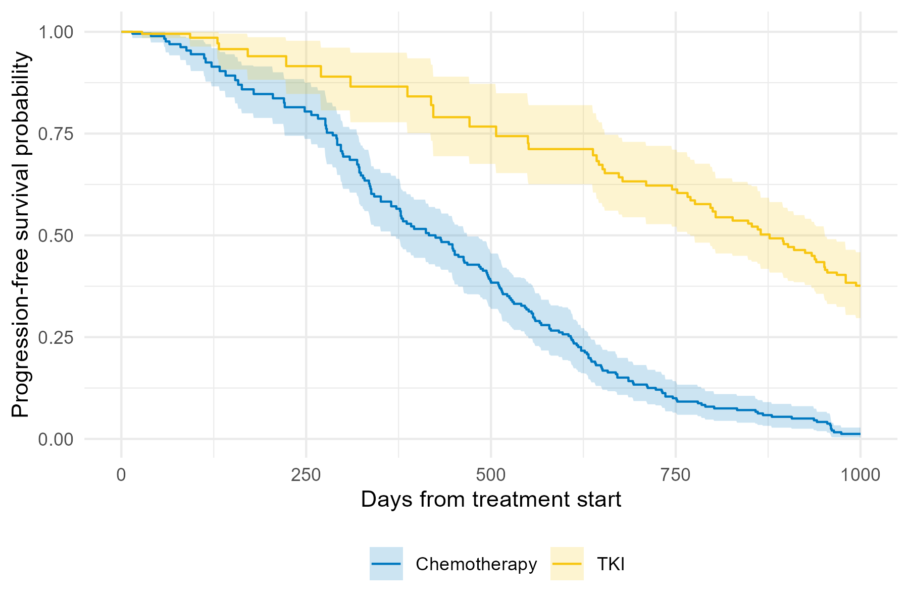

```{r setup, include = FALSE}
knitr::opts_chunk$set(
  collapse = TRUE,
  comment  = "#>"
)
has_ggsurvfit <- requireNamespace("ggsurvfit", quietly = TRUE)
has_gt        <- requireNamespace("gt",        quietly = TRUE)
```

This vignette demonstrates inverse probability of censoring weighting (IPCW)
for a single-event survival outcome. We use a simulated dataset that mimics a
clinical trial of patients with chronic myeloid leukemia. The primary endpoint 
is progression-free survival (PFS). Participants are randomized to receive 
either chemotherapy or a tyrosine kinase inhibitor (TKI). Participants can be 
censored for the primary endpoint due to treatment intolerance or excessive
toxicity, which is expected to occur equally for the two treatment groups.
Treatment group is the factor of interest in this study. Dependent
censoring arises because participants with higher absoluate neutrophil count 
(ANC) at baseline are less likely to go off study due to treatment intolerance,
and therefore to be censored for PFS, and are also less likely to experience a
progression or die.

## Setup

```{r packages, message = FALSE, warning = FALSE}
library(ipcw)
library(survival)
library(purrr)
```

## Simulate data and compute IPCW weights

First, create a simulated dataset of `n=500` patients using the `sim_data_se()` function. Key parameters include:

- `t`: observed time (event or censoring)
- `delta`: event indicator (1 = event, 0 = censored)
- `x`: treatment (0 = chemotherapy, 1 = TKI)
- `W2`: ancillary biomarker that drives informative censoring (ANC)

```{r generate_data}
set.seed(20240429)
dat <- sim_data_se(n = 500)
```

`get_ipcw_wgt_se()` converts the wide dataset to counting-process (long) format
and appends the unstabilized IPCW weight column `wgt`. 

```{r compute-weights-live}
dat_long <- get_ipcw_wgt_se(dat)
```

## IPCW Kaplan-Meier curves

The chunk below requires the **ggsurvfit** package. Install it from CRAN if it 
is not already installed. We plot the IPCW Kaplan-Meier estimates.

```{r km-plot, fig.width = 6, fig.height = 4, warning=FALSE}
# install.packages("ggsurvfit")
library(ggsurvfit)

km_fit <- 
  survfit2(
    Surv(tstart, tstop, delta) ~ x,
    data = dat_long,
    weights = wgt,
    timefix = FALSE)

ggsurvfit(km_fit) +
  xlim(c(0, 1000)) +
  scale_color_hue(labels = c("Chemotherapy", "TKI")) +
  labs(
    x = "Days from treatment start",
    y = "Progression-free survival probability"
  )
```

To get an appropriate variance estimate, we need to account for the fact that 
the IPCW are estimated from the data. We do this using bootstrapping and produce 
a Kaplan-Meier plot with bootstrap-based pointwise confidence intervals. First, 
generate the bootstrapped datasets with weights using the function 
`get_ipcw_boot_se()`. Note that depending on the size of the data and the number of 
bootstrap samples, the bootstrapping step can take some time to run. 

```{r boot-dat, eval = FALSE}
boot_dat <- 
  get_ipcw_boot_se(
    data = dat, 
    B = 500, 
    time_var = "t", 
    event_var = "delta",
    cens_cov = "W2", 
    seed = 20240917)
```

Then, create the plot with the `plot_ipcw_km_boot_ci_se()` function. This too can 
take some time due to the large size of the boostrapped data and the calculation of the pointwise confidence intervals, so the below code is not executed here.

```{r boot-plot, eval = FALSE}
plot_base <-
  plot_ipcw_km_boot_ci_se(
    boot_data = boot_dat, 
    orig_data = dat_long, 
    pre_times = seq(0, 2429, 1),
    covariate = "x",
    weight_var = "wgt",
    event_var = "delta")

plot_base +
  xlim(c(0, 1000)) +
  scale_color_discrete(labels = c("Chemotherapy", "TKI")) +
  scale_fill_discrete(labels = c("Chemotherapy", "TKI")) +
  labs(
    color = "",
    fill = "",
    x = "Days from treatment start",
    y = "Progression-free survival probability"
  ) +
  theme(legend.position = "bottom",
        axis.text = element_text(size = 6),
        axis.title = element_text(size = 6),
        legend.text = element_text(size = 6))
```

```{r boot-plot-save, include = FALSE, eval = FALSE}
ggsave("vignettes/ipcw_km_boot_ci.png", width = 6, height = 4)
```

```{r boot-plot-show, echo = FALSE, fig.width = 6, fig.height = 4}

```

## IPCW Cox regression

Estimate the hazard ratio (HR) for the association between treatment group and PFS, accounting for the dependent censoring. 

Use the convenience wrapper `get_ipcw_cox_fit_se()` to obtain a tibble of results from the weighted Cox regression model.

```{r cox-fit}
cox_fit <- get_ipcw_cox_fit_se(dat_long, weight = "wgt")

cox_fit
```

Then we fit the Cox model to each of the bootstrap datasets and extract the 
log(HR) from each model fit. These will be used to construct bootstrap percentile intervals. Because this process takes some time, the resulting object 
`cox_boot_lhr` is included in this package.

```{r cox-boot-fit, eval = FALSE}
# Fit the Cox model to the B bootstrap samples
cox_boot_fit <-
  boot_dat |>
  map(~ get_ipcw_cox_fit_se(., covariate = "x", weight = "wgt"))

# Extract the B log HRs 
cox_boot_lhr <- 
  map_dbl(cox_boot_fit, "log_hr")
```

```{r echo = FALSE}
data(cox_boot_lhr)
```

Use the function `get_boot_pci_se()` on a dataframe of the log(HR)s to obtain the bootstrap-based 95% confidence interval.

```{r cox-pci}
# Calculate the bootstrap percentile interval
boot_pci <- get_boot_pci_se(data.frame(log_hr = cox_boot_lhr))
```

And combine the results into a table:

```{r boot-res}
result_tab <- data.frame(
  Scale = c("log(HR)", "HR"),
  Estimate = round(c(cox_fit$log_hr, exp(cox_fit$log_hr)), 2),
  Lower_95pct_PI = round(c(boot_pci[[1]], exp(boot_pci[[1]])), 2),
  Upper_95pct_PI = round(c(boot_pci[[2]], exp(boot_pci[[2]])), 2)
)

result_tab
```
